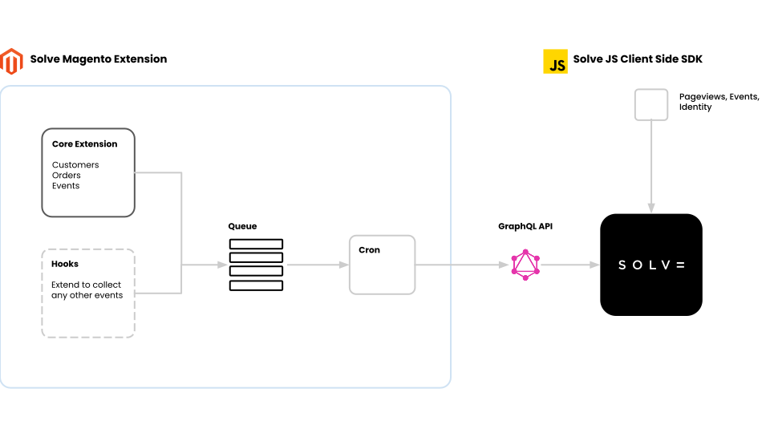

# Solve Magento 2 Integration


[](https://packagist.org/packages/solvedata/plugins-magento2)
[](https://github.com/solvedata/plugins-magento2/blob/main/LICENSE)
[](https://packagist.org/packages/solvedata/plugins-magento2)



## Getting Started

Run the following commands to install the latest version (`v2.1.1`) on your Magento server.

```shell
$ composer require solvedata/plugins-magento2==2.1.1

$ php bin/magento module:enable SolveData_Events
$ php bin/magento setup:upgrade
$ php bin/magento setup:static-content:deploy -f
```

See [Solve's documentation](https://docs.solvedata.app/latest/integrations/magento) for more in-depth instructions.

## Magento Compatibility

Compatible and tested with Magento `v2.3`.

## Features

- Embeds Solve's JS Client Side SDK into the Store's design layout
- Synchronizes Magento data into Solve in real-time (in 1 minutes batches)
    - Customers
    - Carts
    - Orders
    - Payments
    - Returns
- Recover abandoned carts via the `/solve/reclaim` endpoint

## Importing historic data

### Importing customers


```shell
# Arguments `--from` and `--to` are optional

$ php bin/magento solve:import:customers [--from [FROM-ID]] [--to [TO-ID]]
```

### Importing orders


```shell
# Arguments `--from` and `--to` are optional

$ php bin/magento solve:import:orders [--from [FROM-ID]] [--to [TO-ID]]
```

## Getting help

If you have questions, concerns, bug reports, etc., please file an issue in this repository's [Issue Tracker](https://github.com/solvedata/plugins-magento2/issues).

Additionally Solve customers can contact support via emailing support@solve.io.

## Getting involved/Contributing

The [developer instructions](DEVELOPING.md) contain details on how to setup the developer environment.

To contribute, simply make a pull request and add a brief description (1-2 sentences) of your addition or change.
For more details check the [contribution guidelines](CONTRIBUTING.md).
